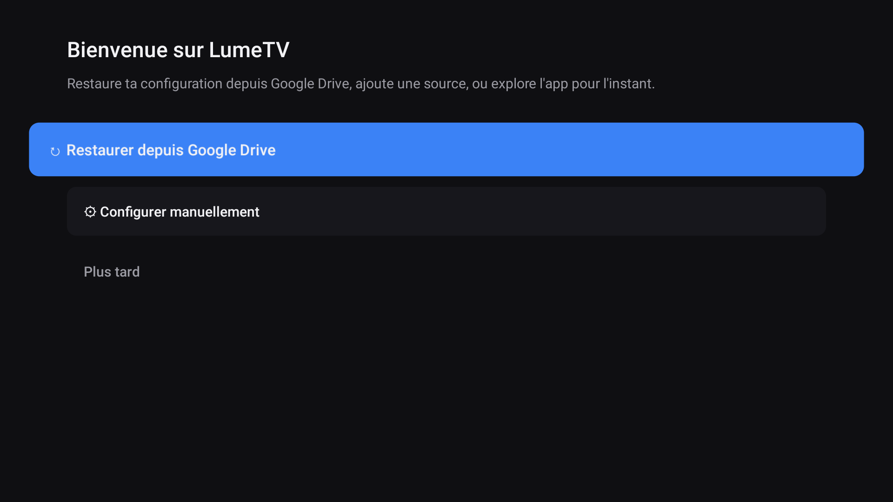
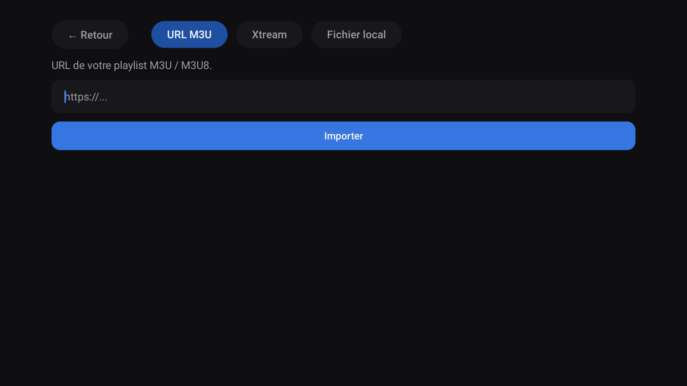
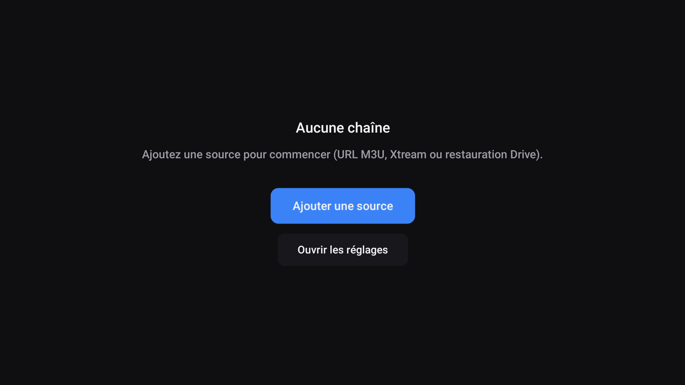
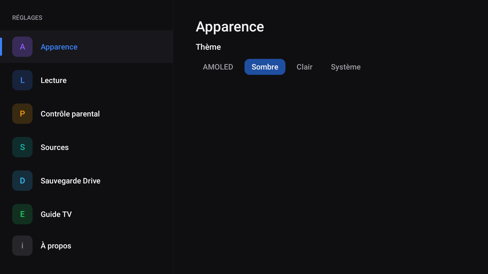
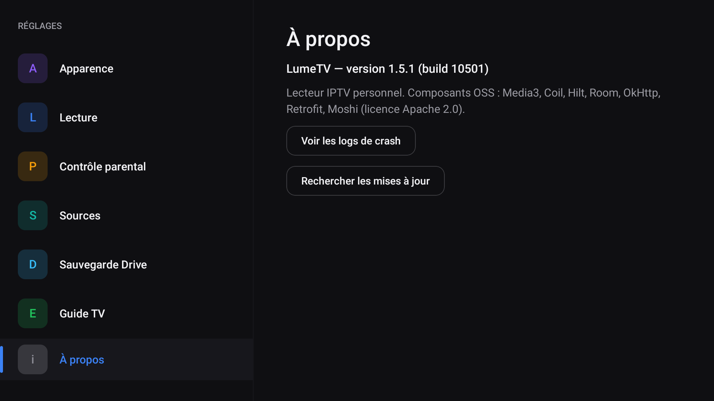

# LumeTV

**Lecteur IPTV pour Android TV** — simple, rapide, pensé pour la télécommande.
Tu fournis ta propre source (M3U ou Xtream), Lume s'occupe du reste : zapping fluide,
guide des programmes (EPG), favoris, contrôle parental.

> ⚠️ **LumeTV ne contient aucune chaîne ni aucun contenu.** C'est uniquement un lecteur :
> tu dois renseigner ta propre source IPTV (à laquelle tu as légalement accès).

---

## 📥 Téléchargement

➡️ **[Dernière version (Releases)](../../releases/latest)** — télécharge le fichier `LumeTV-x.y.z.apk`.

Version actuelle : **1.5.0**.

## ✨ Fonctionnalités

- 📺 **Sources M3U & Xtream** (saisie guidée au premier lancement)
- ⚡ **Zapping fluide** avec aperçu en direct
- 🗓️ **Guide des programmes (EPG)** — grille + « en ce moment »
- ⭐ **Favoris** réorganisables, rattachés à la chaîne même après rechargement
- 🙈 **Masquage** de catégories / chaînes
- 🔒 **Contrôle parental** par code PIN
- 🎚️ **Réglages lecture** : ratio, sous-titres, tampon, sortie audio
- 🔄 **Mises à jour intégrées** (selon configuration)
- ☁️ **Sauvegarde Google Drive** *(voir limite ci-dessous)*

## 📸 Captures

### Premier lancement — restauration Drive-first
Au démarrage, LumeTV propose d'abord de **restaurer ta configuration depuis Google Drive**,
sinon de configurer une source manuellement, ou d'explorer l'app pour l'instant.



### Ajout d'une source
Trois façons d'ajouter une source : **URL M3U**, **Xtream**, ou fichier local.



### Quand aucune source n'est configurée
Un écran clair avec un raccourci pour ajouter une source ou ouvrir les réglages.



### Réglages
Apparence (thèmes AMOLED / Sombre / Clair / Système), lecture, contrôle parental,
sources, sauvegarde Drive, guide TV.



### À propos
Version de l'app et recherche de mises à jour intégrée.



> 🖼️ Les écrans **Chaînes** et **Guide (EPG)** seront ajoutés prochainement (avec une source active).

## 🛠️ Installation

**Pré-requis : Android 10 (API 29) ou supérieur.** Application optimisée pour **Android TV**
(navigation à la télécommande) ; fonctionne aussi sur téléphone/tablette.

Comme l'app n'est pas sur le Play Store, il faut **autoriser l'installation depuis une
source inconnue** :

### Sur Android TV (box / TV connectée)
1. **Paramètres → Sécurité → Sources inconnues** : autorise l'app que tu utiliseras pour installer.
2. Récupère l'APK, par exemple :
   - via l'application **Downloader** (entre l'URL du fichier `.apk` de la Release), ou
   - par **clé USB** (gestionnaire de fichiers), ou
   - par **`adb`** depuis un ordinateur :
     ```bash
     adb connect <ip-de-la-tv>:5555
     adb install -r LumeTV-1.5.0.apk
     ```
3. Lance **LumeTV** et ajoute ta source.

### Sur téléphone / tablette Android
1. Ouvre l'APK téléchargé → autorise « Installer des applis inconnues » pour ton navigateur/gestionnaire.
2. Installe, ouvre, ajoute ta source.

## ☁️ Sauvegarde Google Drive — limite actuelle

La sauvegarde/restauration de ta configuration sur **Google Drive** (dossier privé et
caché de l'app) n'est, pour l'instant, **activée que pour des comptes autorisés**
(l'application OAuth est en phase de test). Avec un autre compte, la connexion Drive
échoue (code 12500) — **le reste de l'app fonctionne normalement**.

> La sauvegarde par **fichier** (sans Google) et/ou l'ouverture à tous les comptes sont
> prévues. En attendant, configure ta source manuellement à chaque installation.

## 🔐 Vie privée

📄 **[Politique de confidentialité complète](PRIVACY.md)**

- Lume ne collecte rien et n'envoie aucune donnée à un serveur tiers.
- Tes identifiants de source sont stockés **chiffrés sur l'appareil**.
- La sauvegarde Drive (si activée) va dans le **dossier App Data** privé de ton Drive,
  invisible dans « Mon Drive », accessible uniquement par l'app.

## ❓ Dépannage

| Symptôme | Solution |
|---|---|
| « Installation bloquée » | Autorise les sources inconnues (voir Installation) |
| Connexion Drive « code 12500 » | Normal pour un compte non autorisé — utilise la config manuelle |
| Aucune chaîne après ajout | Vérifie l'URL/identifiants de ta source, et ta connexion |

---

*LumeTV est un projet personnel, distribué tel quel, sans garantie.*
