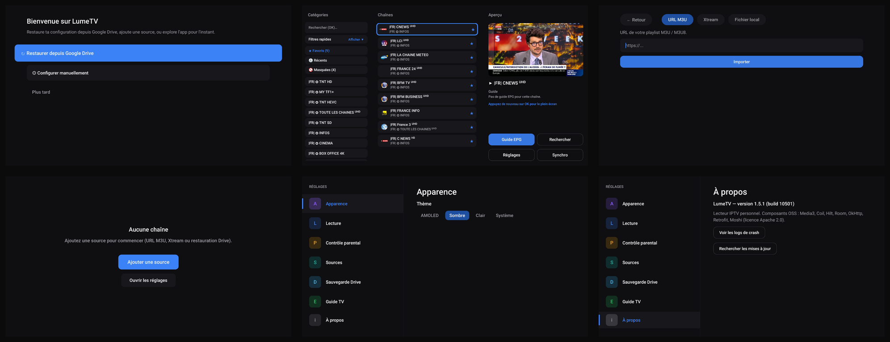
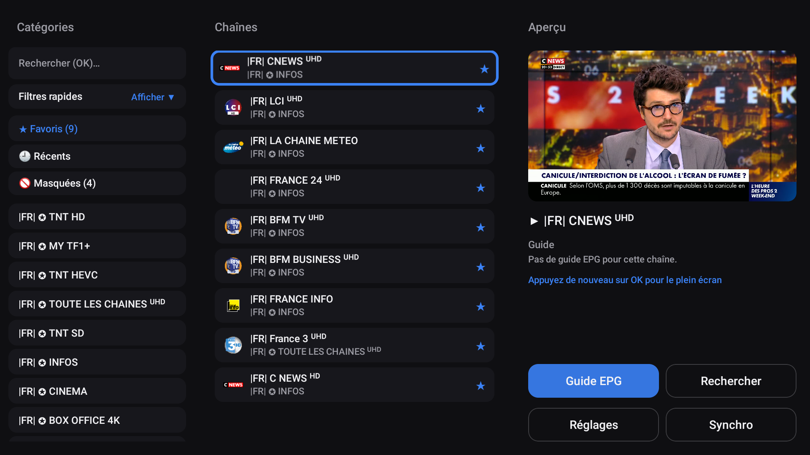
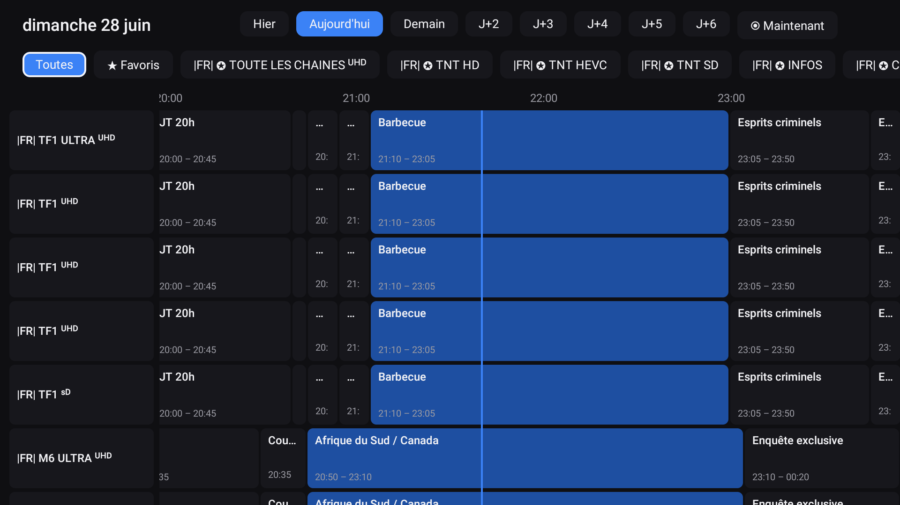
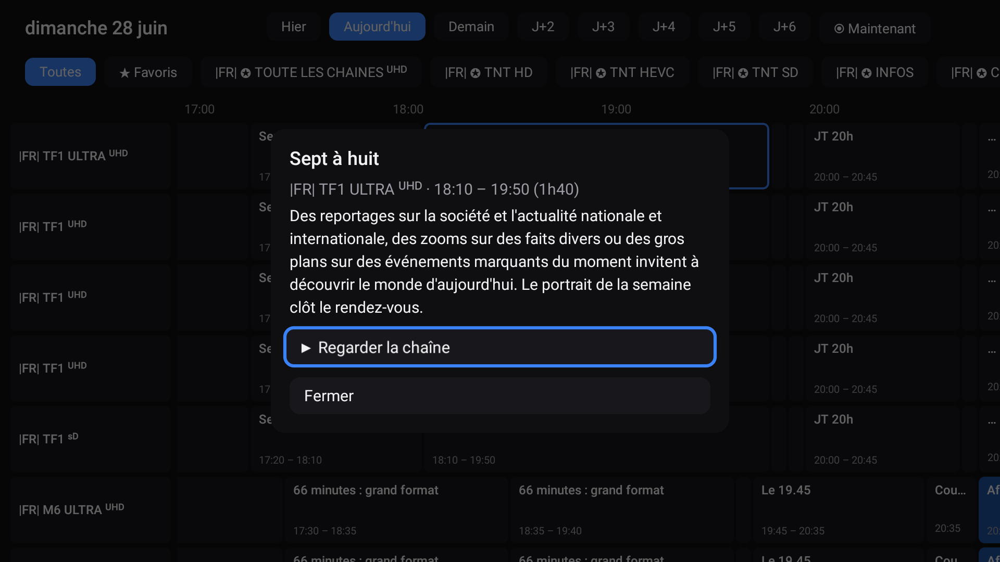

# LumeTV

**Lecteur IPTV pour Android TV** — simple, rapide, pensé pour la télécommande.
Tu fournis ta propre source (M3U ou Xtream), Lume s'occupe du reste : zapping fluide,
guide des programmes (EPG), favoris, contrôle parental.

> ⚠️ **LumeTV ne contient aucune chaîne ni aucun contenu.** C'est uniquement un lecteur :
> tu dois renseigner ta propre source IPTV (à laquelle tu as légalement accès).

---

## 📥 Téléchargement

➡️ **[Dernière version (Releases)](../../releases/latest)** — télécharge le fichier `LumeTV-x.y.z.apk`.

Version actuelle : **1.6.5**.

## ✨ Fonctionnalités

- 📺 **Sources M3U & Xtream** (saisie guidée au premier lancement)
- ⚡ **Zapping fluide** avec aperçu en direct
- 🗓️ **Guide des programmes (EPG)** — grille + « en ce moment »
- ⭐ **Favoris** réorganisables, rattachés à la chaîne même après rechargement
- 🙈 **Masquage** de catégories / chaînes
- 🔒 **Contrôle parental** par code PIN
- 🎚️ **Réglages lecture** : ratio, sous-titres, tampon, sortie audio
- 🔄 **Mises à jour intégrées** (depuis les Releases GitHub)
- ☁️ **Sauvegarde Google Drive** (dossier privé de l'app, tout compte Google)

## 📸 Captures



<table>
  <tr>
    <td align="center" width="333">
      <a href="captures/accueil.png"></a><br>
      <b>Accueil Drive‑first</b><br>
      <sub>Restaurer depuis Drive, ajouter une source, ou explorer</sub>
    </td>
    <td align="center" width="333">
      <a href="captures/chaines.png"></a><br>
      <b>Chaînes</b><br>
      <sub>Catégories · liste · aperçu en direct</sub>
    </td>
    <td align="center" width="333">
      <a href="captures/epg.png"></a><br>
      <b>Guide (EPG)</b><br>
      <sub>Grille · filtre catégorie · ligne « maintenant »</sub>
    </td>
  </tr>
  <tr>
    <td align="center">
      <a href="captures/epg-fiche.png"></a><br>
      <b>Fiche programme</b><br>
      <sub>Synopsis · horaires · « Regarder »</sub>
    </td>
    <td align="center">
      <a href="captures/ajout-source.png"></a><br>
      <b>Ajouter une source</b><br>
      <sub>URL M3U · Xtream · fichier local</sub>
    </td>
    <td align="center">
      <a href="captures/reglages.png"></a><br>
      <b>Réglages</b><br>
      <sub>Apparence · lecture · parental · Drive</sub>
    </td>
  </tr>
  <tr>
    <td align="center">
      <a href="captures/demarrage.png"></a><br>
      <b>Sans source</b><br>
      <sub>Raccourci pour démarrer</sub>
    </td>
    <td align="center">
      <a href="captures/apropos.png"></a><br>
      <b>À propos</b><br>
      <sub>Version + mises à jour intégrées</sub>
    </td>
    <td></td>
  </tr>
</table>

## 🛠️ Installation

**Pré-requis : Android 10 (API 29) ou supérieur.** Application optimisée pour **Android TV**
(navigation à la télécommande) ; fonctionne aussi sur téléphone/tablette.

Comme l'app n'est pas sur le Play Store, il faut **autoriser l'installation depuis une
source inconnue** :

### Sur Android TV (box / TV connectée)
1. **Paramètres → Sécurité → Sources inconnues** : autorise l'app que tu utiliseras pour installer.
2. Récupère l'APK, par exemple :
   - via l'application **Downloader** (entre l'URL du fichier `.apk` de la Release), ou
   - par **clé USB** (gestionnaire de fichiers), ou
   - par **`adb`** depuis un ordinateur :
     ```bash
     adb connect <ip-de-la-tv>:5555
     adb install -r LumeTV-x.y.z.apk
     ```
3. Lance **LumeTV** et ajoute ta source.

### Sur téléphone / tablette Android
1. Ouvre l'APK téléchargé → autorise « Installer des applis inconnues » pour ton navigateur/gestionnaire.
2. Installe, ouvre, ajoute ta source.

## ☁️ Sauvegarde Google Drive

Tu peux sauvegarder/restaurer ta configuration sur **Google Drive**, dans le **dossier
privé et caché** de l'application (invisible dans « Mon Drive », accessible uniquement par
LumeTV, sur ton compte). Pratique pour retrouver tes sources, favoris et réglages sur un
autre appareil.

- Disponible avec **n'importe quel compte Google**.
- La sauvegarde contient ta **configuration** (sources avec identifiants, favoris, réglages,
  PIN parental hashé) — **pas** le flux des chaînes.
- Détails : [politique de confidentialité](PRIVACY.md).

## 🔐 Vie privée

📄 **[Politique de confidentialité complète](PRIVACY.md)**

- Lume ne collecte rien et n'envoie aucune donnée à un serveur tiers.
- Tes identifiants de source sont stockés **chiffrés sur l'appareil**.
- La sauvegarde Drive (si activée) va dans le **dossier App Data** privé de ton Drive,
  invisible dans « Mon Drive », accessible uniquement par l'app.

## ❓ Dépannage

| Symptôme | Solution |
|---|---|
| « Installation bloquée » | Autorise les sources inconnues (voir Installation) |
| Connexion Drive échoue | Vérifie que ta TV est connectée à un compte Google et réessaie |
| Aucune chaîne après ajout | Vérifie l'URL/identifiants de ta source, et ta connexion |

---

*LumeTV est un projet personnel, distribué tel quel, sans garantie.*
